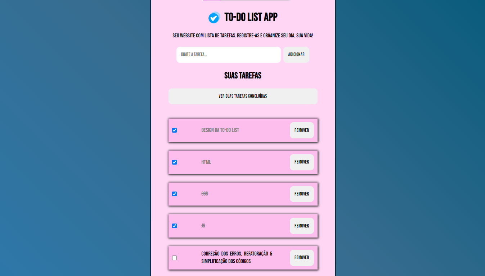
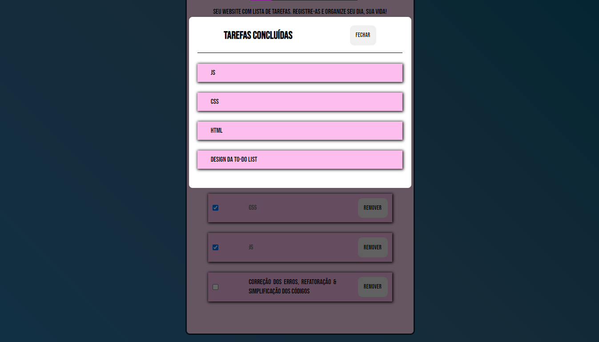

# **_To-Do List_**

Projeto de Lista de Tarefas: **_Digite tarefas, marque-as como concluída ou remova-as_**.

## Tecnologias utilizadas

  
  
  

## Principais Conceitos

- JSON & Methods (Parse/Stringify).
- Localstorage & Methods (Get/Set).
- Elements Clone.
- Arrays Manipulation & Method.
- Responsiveness & Responsible Units of Measure.
- Functions, Parameters and Arguments.
- Code Refactoring & Organization.
- Animate Method
- Events.

**_Deploy: https://vitorsantos920.github.io/newToDoList/_**

## Imagem do Projeto

